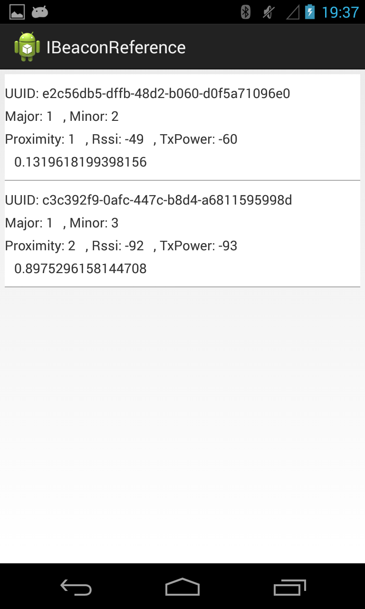

Android-iBeacon-Demo
====================

Demo app for the Android library providing APIs to interact with iBeacons which is developed by:  http://developer.radiusnetworks.com/ibeacon/android/index.html

Lib project used in the Demo is provided by radiusnetworks.com : 
https://github.com/RadiusNetworks/android-ibeacon-service

